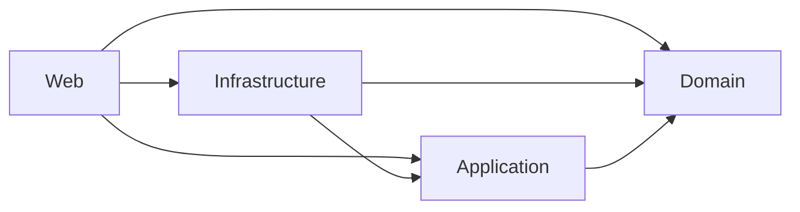
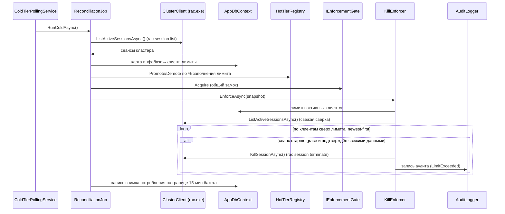
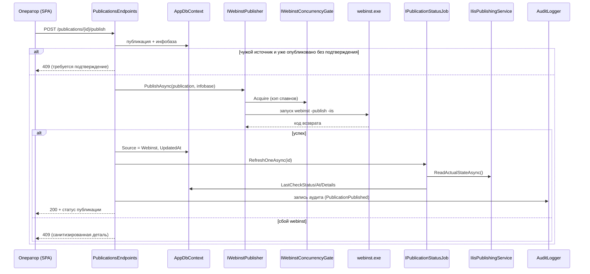
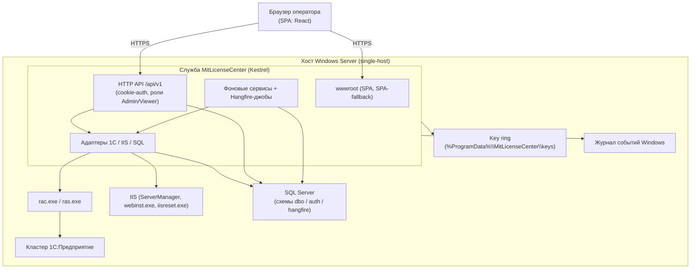

# MitLicense Center — архитектура

Фактическая архитектура системы: слои и anti-corruption граница, интеграции с
кластером 1С (rac/RAS), IIS и SQL Server, фоновая обработка, ключевые потоки и
схема развёртывания. Термины — по глоссарию `01_OVERVIEW.md`.

Система — single-host (ADR-28): панель управляет тем узлом, на котором установлена.
Бэкенд — служба Windows на ASP.NET Core (Kestrel), фронтенд — SPA, отдаваемая той же
службой из `wwwroot`. Кластер 1С, IIS и SQL Server расположены на том же хосте.

---

## 1. Слои и направление зависимостей

Бэкенд разбит на четыре проекта с однонаправленным графом зависимостей:

| Слой | Проект | Содержимое |
|---|---|---|
| **Domain** | `MitLicenseCenter.Domain` | Сущности (`Tenant`, `Infobase`, `Publication`, `SettingEntry`), enum-ы (`InfobaseStatus`, `PublicationSource`, `PublicationPublishStatus`, `AuditActionType`, `AuditReason`), ключи настроек. Без зависимостей. |
| **Application** | `MitLicenseCenter.Application` | Порты-интерфейсы (`IClusterClient`, `IIisPublishingService`, `IIisLifecycleService`, `IWebinstPublisher`, `ISqlBackupService`, `I*Discovery`, `I*Job`, `IKillEnforcer`, `IEnforcementGate`, `ISettingsSnapshot`/`ISettingsStore`), модели-контракты, чистые правила (расчёт потребления, whitelist настроек). Зависит только от Domain. |
| **Infrastructure** | `MitLicenseCenter.Infrastructure` | Реализации портов: RAS-адаптер над `rac.exe`, IIS-адаптеры, `webinst`-публикатор, SQL-адаптеры, EF Core (`AppDbContext`, миграции), Identity, фоновые сервисы и Hangfire-джобы. |
| **Web** | `MitLicenseCenter.Web` | HTTP-эндпоинты (`/api/v1`), аутентификация/авторизация, конвейер middleware, DI-композиция, регистрация Hangfire и фоновых сервисов, SPA-fallback. |

### Гард границ (`LayerBoundaryTests`)

Направление зависимостей закреплено автоматическими тестами на уровне IL
(NetArchTest), а не только дисциплиной ревью. Тесты `LayerBoundaryTests`:

1. **Domain** не зависит ни от `Application`, ни от `Infrastructure`, ни от `Web`.
2. **Application** не зависит от `Infrastructure` и `Web` — держит только порты и контракты.
3. **Web** не ссылается напрямую на адаптерные неймспейсы инфраструктуры
   1С/IIS (`Infrastructure.Clusters`, `…Publishing`, `…Discovery`, `…Jobs`,
   `…Performance`, `…Backups`), на `Microsoft.Web.Administration` и на тип
   `System.Diagnostics.Process`.

Анализ на уровне IL ловит запрещённый тип даже в теле метода (например, попытку
создать `Process` прямо в хендлере) — это недостижимо рефлексией по сигнатурам.

---

## 2. Anti-corruption граница (ADR-20)

Главное правило границы: **Web обращается к внешним системам 1С/IIS/SQL-discovery
только через интерфейсы Application; реализации живут в Infrastructure.** Запуск
процессов (`rac.exe`, `webinst.exe`, `iisreset.exe`), работа с `Microsoft.Web.Administration`
и SQL-discovery инкапсулированы в адаптерах и наружу видны лишь как порты.

Реальные адаптеры:

| Порт (Application) | Адаптер (Infrastructure) | Внешняя система |
|---|---|---|
| `IClusterClient` | `RacExecutableRasClusterClient` (+ `IRacProcessRunner` → `SystemProcessRacRunner`) | Кластер 1С через `rac.exe`/RAS |
| `IRasServiceManager` | `ScRasServiceManager` (обнаружение — `IServiceRegistryReader`/`IServiceStateReader`; действия — `IScProcessRunner` → `ScProcessRunner`) | Служба Windows для `ras.exe`: обнаружение через реестр + `ServiceController`, register/update/start через `sc.exe` |
| `IIisPublishingService` | `OneCIisPublishingService` | IIS: чтение факта публикации, правка `web.config` |
| `IIisLifecycleService` | `OneCIisLifecycleService` | IIS: пулы/сайты/iisreset |
| `IWebinstPublisher` | `OneCWebinstPublisher` | Публикация/снятие через `webinst.exe` |
| `ISqlBackupService` | `SqlBackupAdapter` | SQL Server: `BACKUP DATABASE` |
| `ISqlDatabaseDiscovery` / `ISqlInstanceDiscovery` | `SqlDatabaseDiscovery` / `SqlInstanceDiscovery` | SQL: перечисление баз/инстансов |
| `IRacPathDiscovery` / `IPlatformVersionDiscovery` | `RacPathDiscovery` / `PlatformVersionDiscovery` | ФС: сканирование установок 1С |

### Легитимные вертикали к собственной БД панели

Граница охраняет только внешние системы. К **собственной БД панели** Web обращается
напрямую — это разрешённый ADR-20 вертикальный срез. Поэтому тест границы запрещает
не всю сборку Infrastructure, а именно адаптерные неймспейсы; Web легитимно использует:

- `Infrastructure.Persistence` — `AppDbContext` прямо в эндпоинтах;
- `Infrastructure.Identity` — `AppUser`/`AppRole`/`Roles`;
- `Infrastructure.Audit` — сущность `AuditLog` через `db.AuditLogs`;
- `Infrastructure.Settings` — сидер настроек в bootstrap;
- корневой `Infrastructure` — метод `AddInfrastructure`.

---

## 3. Интеграция с кластером 1С (rac/RAS)

Единственный адаптер кластера — `RacExecutableRasClusterClient`. Он не общается с RAS
по сети напрямую, а запускает утилиту `rac.exe` (через `IRacProcessRunner`), которая
говорит с локальным `ras.exe`. Контракт интеграции (ADR-3.3):

- **Процессный запуск.** `SystemProcessRacRunner` — тонкая обёртка над
  `System.Diagnostics.Process`: `UseShellExecute=false`, перенаправленные stdout/stderr,
  `CreateNoWindow`. Аргументы передаются списком (`ArgumentList`), без склейки строки.
- **Декодирование OEM-кодовой страницы.** `rac.exe` пишет вывод в активную OEM-кодировку
  процесса (на русскоязычной Windows — CP866), а не в UTF-8. Адаптер читает сырые байты
  stdout/stderr и декодирует их в кодировке, **определяемой динамически** из
  `CultureInfo.CurrentCulture.TextInfo.OEMCodePage` (с регистрацией code-page-провайдера;
  fallback — UTF-8). Корректное декодирование нужно, в частности, для распознавания
  русского маркера «Сеанс с указанным идентификатором не найден» (идемпотентный kill).
- **Таймаут и бюджет спавна.** На один вызок `rac.exe` — фиксированный дедлайн 30 с
  (по таймауту процесс снимается `Kill(entireProcessTree: true)`, так как `rac.exe`
  держит дочерний процесс для диалога с RAS). UUID кластера кэшируется в
  `IClusterUuidCache` (singleton): при тёплом кэше команда `cluster list` не спавнится,
  поэтому опрос сеансов — это 1 процесс на тик; при ошибке cluster-scoped команды кэш
  инвалидируется и UUID перерезолвится.
- **Команды.** `cluster list` (резолв UUID), `session list` (снимок сеансов и perf-данные),
  `session terminate` (kill), `infobase summary list` (discovery баз кластера),
  `process list` (рабочие процессы для раздела «Быстродействие»). Endpoint и
  cluster-admin креды (`--cluster-user`/`--cluster-pwd`) подставляются из настроек;
  при пустых кредах флаги опускаются (анонимный доступ).
- **Факт лицензии.** Признак «сеанс потребляет лицензию» — факт из `rac session list
  --licenses` (`LicenseStatus`, ADR-48), не эвристика по `app-id`. Холодный тир делает
  второй вызов `--licenses` и сшивает по `session`-GUID; горячий берёт классификацию из
  кэша `ILicenseFactCache` (один спавн rac на тик).

**Публикация и смена платформы** — отдельные процессы/файловые операции (см. §4),
не через RAS. **Kill сеансов** выполняет `session terminate`; результат
классифицируется как «завершён», «уже отсутствует» (идемпотентный no-op) или «ошибка».

Health кластера отслеживает независимый фоновый сервис `RasHealthProbingService`
(ping `cluster list` каждые 30 с) — он публикует состояние для дашборда и отвечает на
вопрос «доступен ли RAS сейчас», отдельный от свежести снимка сеансов.

**Управление службой RAS (ADR-47).** Ортогонально адаптеру `rac.exe`: `IRasServiceManager`
(`ScRasServiceManager`) управляет жизненным циклом **локальной** службы Windows, под которой
работает `ras.exe`. Обнаружение службы идёт через **реестр**
(`HKLM\SYSTEM\CurrentControlSet\Services`, фильтр `ImagePath` по `ras.exe`) плюс состояние
через `ServiceController` — один проход, без спавна процессов; `sc.exe` (OEM-декод вывода как
у `rac.exe`/`iisreset.exe`) используется только для **действий** (`create`/`config`/`start`/
`stop`). Протокол RAS не реверсится, долгоживущий сокет не вводится — это отдельный от опроса
сеансов контур. Работает **по требованию** (он-деманд из веб-панели), не фоном: эндпоинт
статуса диагностирует одно из 4 состояний (ОК / не зарегистрирована / устарела / остановлена)
и отдаёт предпросмотр команды `sc`; действия register/update/start выполняются по запросу
оператора. Обнаружение службы — по `ImagePath`, содержащему `ras.exe` (имя у операторов не
стандартизировано); `ras.exe` для регистрации ищется в тех же версионных bin-каталогах, что и `rac.exe`.
Цель — локальный агент кластера (`localhost:1540`), порт службы — из `OneC.RAS.Endpoint`,
платформа — `OneC.DefaultPlatformVersion` (хост фиксирован `localhost`, single-host ADR-28).
Действия пишут аудит **600-серии** (`RasServiceRegistered`/`Updated`/`Started`, server-scope).

---

## 4. Интеграция с IIS (ADR-24)

С IIS работают два адаптера через `Microsoft.Web.Administration` (`ServerManager`) и,
для полного перезапуска, через спавн `iisreset.exe`. Оба помечены
`[SupportedOSPlatform("windows")]` и в production-DI регистрируются как Windows-only.
Операции IIS требуют прав администратора (доступ к метабазе/`ServerManager`, `iisreset`).

- **`IIisPublishingService` (`OneCIisPublishingService`)** — чтение факта публикации
  (наличие сайта, виртуального каталога, `web.config`; версия платформы из пути к
  `wsisapi.dll`) и **смена версии платформы**: правка version-сегмента пути к `wsisapi.dll`
  в `web.config` (fallback — `default.vrd`), атомарной заменой файла. Создание/перезапись
  публикаций здесь не делается.
- **`IIisLifecycleService` (`OneCIisLifecycleService`)** — жизненный цикл (ADR-24):
  recycle/start/stop пула приложений, start/stop/restart сайта, полный `iisreset`
  (restart/stop/start), а также чтение состояния пулов/сайтов и службы W3SVC.
- **`IWebinstPublisher` (`OneCWebinstPublisher`)** — публикация и снятие публикации через
  `webinst.exe` той версии платформы, что указана в публикации (`-publish -iis` /
  `-delete`). `webinst` целиком перезаписывает `default.vrd` и `web.config`, поэтому
  повторная публикация чужого (не `Webinst`) источника требует подтверждения оператора.

**Гейт сериализации iisreset.** Все мутации жизненного цикла IIS проходят через
`IIisResetConcurrencyGate` (singleton, N=1): два recycle/iisreset одновременно
недопустимы. Discovery-чтения замок не берут. Спавны `webinst.exe` ограничивает
отдельный `IWebinstConcurrencyGate` (защита бюджета спавнов при массовой публикации).

`iisreset.exe` — системная утилита и пишет в OEM-кодировку (как `rac.exe`), поэтому его
вывод декодируется динамически по OEM-кодовой странице; `webinst.exe`, напротив, пишет
UTF-16LE и декодируется как `Encoding.Unicode`.

---

## 5. SQL Server

- **Discovery.** `SqlDatabaseDiscovery` перечисляет пользовательские базы через
  `sys.databases`; `SqlInstanceDiscovery` — инстансы из локального реестра. Сервер берётся
  из настройки `Sql.Server` (единственный источник, single-host); параметры аутентификации
  наследуются из `ConnectionStrings:Default` (меняются только `DataSource` и каталог `master`).
- **Бэкапы (ADR-27).** `SqlBackupAdapter` исполняет весь безопасный цикл server-side, не
  трогая ФС SQL-хоста из приложения: проверка роли `sysadmin`, существование базы, оценка
  размера (`FILEPROPERTY 'SpaceUsed'`; нет оценки — бэкап не стартует), проверка свободного
  места на локальном диске (`xp_fixeddrives` + запас), `BACKUP DATABASE … WITH COPY_ONLY,
  COMPRESSION, CHECKSUM, FORMAT, INIT`, затем `RESTORE VERIFYONLY WITH CHECKSUM` и только
  после успешной проверки — удаление прошлых `.bak` базы (keep-latest: новый-перед-удалением).
  `COPY_ONLY` не сбрасывает differential base и не ломает внешнюю дифф-цепочку. Имя базы
  попадает в динамический SQL только через `QUOTENAME`, путь — строковым параметром.
- **EF Core и миграции.** `AppDbContext` наследует `IdentityDbContext`; провайдер —
  SQL Server с `EnableRetryOnFailure`. Схема приводится миграциями
  (`Persistence/Migrations`, таблица истории `__EFMigrationsHistory` в схеме `dbo`).
- **Схемы БД.**
  - `dbo` — доменные и телеметрийные таблицы: `Tenants`, `Infobases`, `Publications`,
    `AuditLogs`, `Settings`, `LicenseUsageSnapshots`, `PerfRecordings`/`PerfRecordingSamples`,
    `DatabaseBackups`, `HiddenClusterInfobases`.
  - `auth` — таблицы ASP.NET Core Identity (`Users`, `Roles`, `UserRoles`, `UserClaims`,
    `UserLogins`, `UserTokens`, `RoleClaims`).
  - `hangfire` — служебная схема Hangfire (создаётся им самим при старте).
- **Хранение времени.** Все `DateTime` пишутся в UTC; конвертер при чтении помечает их
  `Kind=Utc`, чтобы JSON получал суффикс `Z` и фронт парсил время корректно.

---

## 5a. GitHub Releases (проверка обновлений, ADR-50)

Единственная исходящая HTTP-интеграция панели — в один ряд к адаптерам 1С/IIS/SQL за
anti-corruption границей (ADR-20). Порт `IGitHubReleaseClient` (Application/Updates) изолирует
контракт GitHub Releases API; реализация `GitHubReleaseClient` (Infrastructure/Updates) — первый
типизированный `HttpClient` в проекте (`AddHttpClient`, `BaseAddress=https://api.github.com/`,
таймаут 10 с, обязательный `User-Agent`, заголовки `Accept: application/vnd.github+json` +
`X-GitHub-Api-Version`). Запрос анонимный: `GET repos/{owner}/{repo}/releases/latest`. Любой сбой
(сеть, HTTP-не-2xx, rate-limit 403, битый JSON) поглощается внутри адаптера и наружу отдаётся
`null` = «проверка недоступна»; клиентская отмена пробрасывается. Сравнение версий — чистый
semver-компаратор `AppVersion`/`UpdateComparison` (Domain/Updates). Подробности решения — ADR-50.

---

## 6. Фоновая обработка

Фоновая работа делится на **Hangfire recurring-джобы** (хранилище — схема `hangfire`
в том же SQL) и **`IHostedService`-сервисы** вне Hangfire (для sub-minute циклов и циклов,
чей каданс настраивается оператором — минута-минимум CRON Hangfire их не покрывает).

### Hangfire recurring-джобы

| Id | Порт / метод | Cron | Что делает |
|---|---|---|---|
| `publication-status-refresh` | `IPublicationStatusJob.RefreshAllAsync` | `*/5 * * * *` (throttle до `Drift.IntervalMinutes`) | Read-only обновление статуса публикаций в IIS (`LastCheck*`); IIS не меняет, аудит не пишет |
| `audit-retention` | `IAuditRetentionJob.RunAsync` | `0 3 * * *` | Ночная очистка журнала аудита (окно — `Audit.RetentionDays`) |
| `backup-retention` | `IBackupRetentionJob.RunAsync` | `15 3 * * *` | Ночное удаление устаревших файлов бэкапов (TTL — `Backup.TtlHours`) |
| `license-usage-retention` | `ILicenseUsageRetentionJob.RunAsync` | `30 3 * * *` | Ночная очистка истории потребления лицензий (окно — `LicenseUsage.RetentionDays`) |
| `perf-recording-retention` | `IPerfRecordingRetentionJob.RunAsync` | `45 3 * * *` | Ночная очистка записей «Быстродействия» (`PerfRecordings` + каскадные сэмплы); срок — константа в джобе (90 дней), оператором не настраивается |

Завершённым джобам выставляется ограниченный срок хранения в схеме `hangfire`. Дашборд
Hangfire доступен на `/hangfire` только роли Admin.

### Фоновые сервисы (`IHostedService`)

| Сервис | Период | Назначение |
|---|---|---|
| `ColdTierPollingService` | `Polling.Cold.IntervalSeconds` (по умолчанию 15 с) | «Холодный» цикл сеансов: полный снимок сеансов кластера, расчёт потребления, продвижение клиентов в hot-tier, семпл телеметрии лицензий и enforcement-kill. Таймер читает интервал каждый цикл; на старте — немедленный warm-up снимка (ADR-6.1). Раньше был Hangfire-джобом `cold-snapshot`, но минута-минимум CRON делала `Polling.ColdIntervalSeconds` инертной (MLC-154) |
| `HotTierPollingService` | `Polling.Hot.IntervalSeconds` (по умолчанию 4 с) | «Горячий» цикл сеансов: частый опрос только для клиентов у лимита (hot-tier), overlay свежих данных в снимок для UI и enforcement по этим клиентам |
| `RasHealthProbingService` | 30 с | Независимый ping RAS (`cluster list`) для индикатора доступности на дашборде |
| `PerfRecordingSamplingService` | `Performance.RecordingSampleIntervalSeconds` | Драйвер сэмплинга активной записи раздела «Быстродействие»; на старте закрывает осиротевшие записи |
| `BackupPumpService` | wake-сигнал либо тайм-аут 5 с | Насос очереди бэкапов: FIFO с потолком параллелизма; на старте закрывает осиротевшие запущенные бэкапы |

### Защита от двойного enforcement

Завершение сеансов выполняют **два** пути — cold-сервис и hot-сервис (оба
`IHostedService`). Чтобы kill исполнял ровно один путь за раз, оба берут общий
singleton-замок `IEnforcementGate` вокруг fetch и kills — это исключает over-kill.
Cold-петля к тому же последовательна (`await` следующего прогона), а узел один
(ADR-28) — распределённый лок не нужен.

---

## 7. Ключевые потоки

### 7.1 Контроль квот (cold/hot) и enforcement-kill

`ColdTierPollingService` раз в цикл снимает все сеансы, считает потребление по клиентам и
продвигает тех, кто перешёл порог (по умолчанию 90 %), в hot-tier; `HotTierPollingService`
часто опрашивает только hot-клиентов. Оба под общим замком вызывают `IKillEnforcer`,
который завершает избыточные сеансы по принципу newest-first, пропуская сеансы моложе
`Enforcement.KillGraceSeconds`.

### 7.2 Публикация инфобазы

Оператор публикует инфобазу из карточки базы. Эндпоинт проверяет гейт перезаписи чужой
публикации, вызывает `webinst.exe` через адаптер, фиксирует источник `Webinst`, обновляет
фактический статус и пишет аудит.

---

## 8. Компонентная диаграмма

---

## 9. Развёртывание

- **Служба Windows.** Хост запускается через `UseWindowsService` (имя службы
  `MitLicenseCenter`); под SCM сервис отвечает на start/stop, content root = каталог exe,
  логи направляются в **Журнал событий Windows**. Веб-сервер — Kestrel.
- **Артефакт.** Релизная сборка (`publish-release.ps1`) — self-contained single-file
  публиш под win-x64: один `MitLicenseCenter.Web.exe` со вшитым рантаймом .NET (trimming
  не применяется — EF Core/Hangfire/Identity рефлексивны). Есть и framework-dependent
  режим как fallback. Установщик (`installer/MitLicenseCenter.iss`) регистрирует службу
  через `sc create … start= auto`, под `LocalSystem` либо под выбранным ОС-аккаунтом,
  и проставляет NTFS ACL на конфиг и секреты (только SYSTEM/Administrators).
- **SPA из wwwroot.** Собранный фронтенд кладётся в `wwwroot` при `dotnet publish`
  (таргет `CopySpaToPublish`, ADR-30). Kestrel отдаёт статику same-origin с API
  (`UseStaticFiles`); неперехваченные маршруты получают `index.html` через `MapFallback`
  (history-fallback для клиентского роутинга). Зарезервированные `/api/*` и `/hangfire/*`
  под fallback не попадают — неизвестный `/api/*` честно отдаёт 404.
- **Конфигурация.** Базовые параметры — в `appsettings(.Environment).json`
  (`ConnectionStrings:Default`/`Hangfire`, `Security:EnforceHttps`/`EnableSwagger`,
  логирование). Runtime-настройки (RAS, SQL-сервер, IIS, политика лицензий, частота опроса,
  сроки хранения, бэкапы) хранятся в БД (`dbo.Settings`) и ограничены **whitelist-ом**
  `SettingDefinitions`: эндпоинт `PUT /settings/{key}` принимает только известные ключи и
  валидирует значение по типу/диапазону. Снимок настроек кэшируется в памяти с TTL ≈ 30 с
  и инвалидируется при записи.
- **Секреты и key ring (ADR-8).** Секретные настройки (например, пароль администратора
  кластера) шифруются через ASP.NET Data Protection (protector с purpose `mlc.settings.v1`)
  и хранятся в `dbo.Settings` как `varbinary`. Сам key ring лежит в файловой системе
  (`%ProgramData%\MitLicenseCenter\keys` в проде; `%LocalAppData%\…` в dev) в переносимом
  открытом формате без шифрования — защита обеспечивается NTFS ACL. База данных и парный
  key ring образуют единый бэкап-юнит: при их рассогласовании расшифровка секрета даёт
  понятную операционную ошибку, а не сырое исключение.
- **Транспорт.** HSTS и HTTPS-redirect включаются только вне Development и только при
  `Security:EnforceHttps=true` (когда Kestrel сам терминирует TLS); за терминирующим прокси
  флаг остаётся выключенным. Cookie auth настроена под SPA: 401 JSON вместо редиректа,
  `HttpOnly`, `SameSite=Strict`, `Secure=Always` в проде; немедленный отзыв доступа —
  через security-stamp с ревалидацией куки.
- **Middleware-конвейер (порядок).** Конвейер ASP.NET Core в продакшен-среде выстроен
  в следующем порядке (сокращённо):
  `UseExceptionHandler` → `UseSecurityHeaders` → `UseHsts`/`UseHttpsRedirection`
  (при `EnforceHttps=true`) → `UseStaticFiles` → `UseAuthentication` → `UseAuthorization`
  → `UseRateLimiter` → эндпоинты + SPA-fallback. CORS-middleware нет — фронтенд и API
  same-origin (ADR-30).
  `UseSecurityHeaders` (ADR-41) выставляет `X-Content-Type-Options: nosniff`,
  `Referrer-Policy: no-referrer`, `X-Frame-Options: DENY` и `Content-Security-Policy`
  (CSP) на все ответы кроме путей Swagger (`/api/docs*`), где CSP и X-Frame-Options
  намеренно опускаются для корректной работы Swagger UI.
  `UseRateLimiter` (ADR-42) применяет политику `"login"` — фиксированное окно 10 запросов
  в минуту на IP — только к `/api/v1/auth/login`; исчерпание лимита возвращает `429 Too
  Many Requests`.
- **Bootstrap.** На старте, до приёма трафика, синхронно: создание БД при отсутствии,
  миграции и сидинг администратора и дефолтных настроек. Любая ошибка инициализации —
  fail-fast (процесс падает, не начиная принимать запросы).
