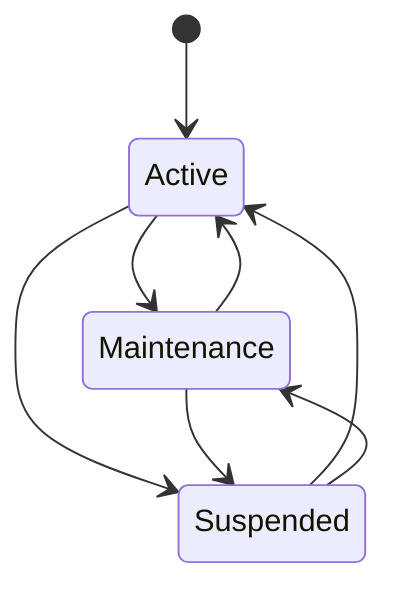
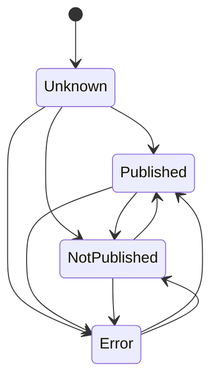
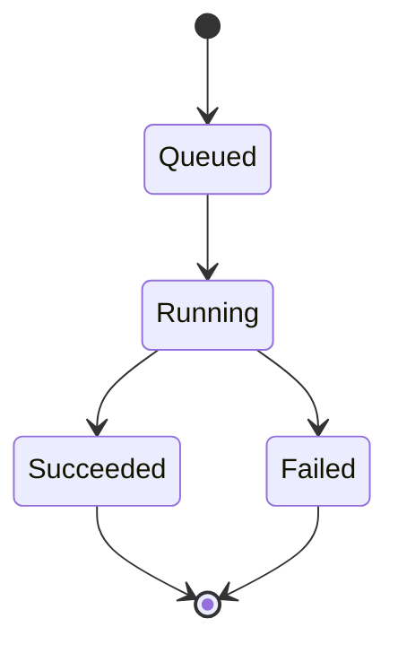
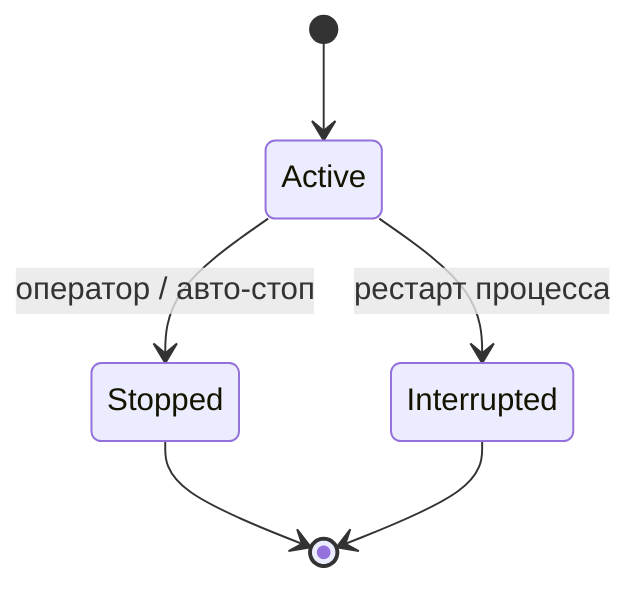
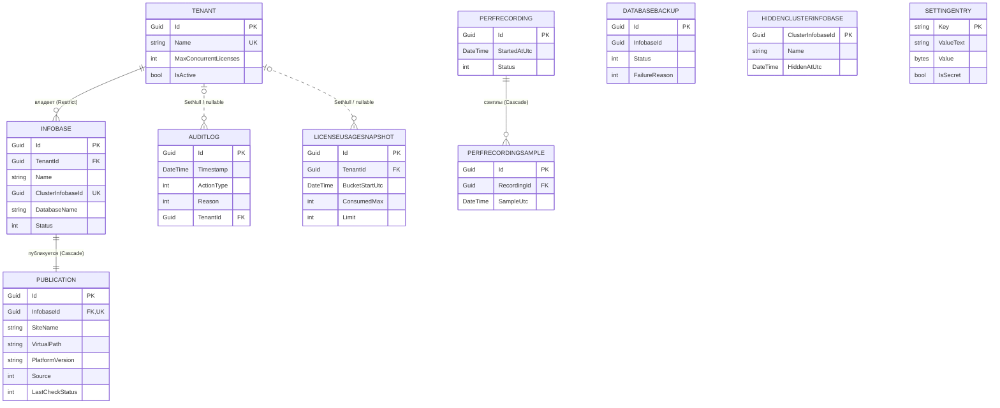

# Доменная модель и схема данных

Этот документ описывает сущности MitLicense Center, их связи, инварианты,
жизненные циклы, замороженные целочисленные значения перечислений, правила
лимитов лицензий и схему базы данных «как построено». Источник всех утверждений —
доменный код (`MitLicenseCenter.Domain`), сущности-телеметрии в Infrastructure,
конфигурации EF в `AppDbContext.OnModelCreating` и снимок модели
`AppDbContextModelSnapshot.cs`. Терминология — по `01_OVERVIEW.md`, §5.

База данных — единственная для приложения; в ней сосуществуют три схемы:
доменные и телеметрийные таблицы в `dbo`, таблицы ASP.NET Core Identity в `auth`,
рабочие таблицы Hangfire в `hangfire`. На один SQL-хост развёрнута одна
инсталляция панели (single-host, ADR-28).

---

## 1. Сущности

### 1.1 Доменное ядро (`MitLicenseCenter.Domain`)

Доменные сущности реализуют маркер `IEntity` (`Guid Id { get; }`). Все метки
времени хранятся в UTC; EF при чтении помечает любое `DateTime` как
`DateTimeKind.Utc`, поэтому JSON на проводе несёт суффикс `Z`.

**Tenant — клиент (арендатор).**

| Поле | Тип | Смысл |
|---|---|---|
| `Id` | `Guid` | Первичный ключ. |
| `Name` | `string` (обяз.) | Название клиента. Глобально уникально. |
| `MaxConcurrentLicenses` | `int` | Лимит одновременных лицензионных сеансов. `0` = без лимита. |
| `IsActive` | `bool` | Активен ли клиент. Enforcement применяется только к активным. |
| `CreatedAt` | `DateTime` | Момент создания. |
| `UpdatedAt` | `DateTime?` | Момент последнего изменения; `null` до первого изменения. |

**Infobase — информационная база.**

| Поле | Тип | Смысл |
|---|---|---|
| `Id` | `Guid` | Первичный ключ. |
| `TenantId` | `Guid` | Владелец-клиент. Смена владельца — только через `POST /infobases/{id}/reassign` (с проверкой коллизии имени и записью в аудит); обычный PUT/форма владельца не меняют. |
| `Name` | `string` (обяз.) | Имя базы в панели. Уникально в пределах клиента. |
| `ClusterInfobaseId` | `Guid` | Идентификатор базы в кластере 1С. Глобально уникален. |
| `DatabaseName` | `string` (обяз.) | Имя базы в SQL Server. SQL-инстанс задаётся одной настройкой `Sql.Server` (single-host), серверного поля у базы нет. |
| `Status` | `InfobaseStatus` | Операционный статус в панели. |
| `CreatedAt` / `UpdatedAt` | `DateTime` / `DateTime?` | Метки создания/изменения. |

**Publication — публикация инфобазы в IIS.** Одна инфобаза — одна публикация
(связь 1-к-1, обязательная).

| Поле | Тип | Смысл |
|---|---|---|
| `Id` | `Guid` | Первичный ключ. |
| `InfobaseId` | `Guid` | Инфобаза публикации (FK, уникален). |
| `SiteName` | `string` (обяз.) | Сайт IIS. |
| `VirtualPath` | `string` (обяз.) | Виртуальный путь приложения IIS. |
| `PlatformVersion` | `string` (обяз.) | Версия платформы 1С (`Мажор.Минор.Билд.Ревизия`). |
| `Source` | `PublicationSource` | Происхождение публикации. Дефолт `Unknown`. |
| `LastCheckStatus` | `PublicationPublishStatus` | Результат последней проверки факта в IIS. Read-only, дефолт `Unknown`. |
| `LastCheckAt` | `DateTime?` | Момент последней проверки. |
| `LastCheckDetails` | `string?` | Текстовая детализация проверки. |
| `PhysicalPathOverride` | `string?` | Переопределение физического пути приложения IIS; `null`/пусто → путь по convention. |
| `CreatedAt` / `UpdatedAt` | `DateTime` / `DateTime?` | Метки создания/изменения. |

**HiddenClusterInfobase — скрытая нераспределённая база кластера.** Игнор-лист
служебных баз кластера, которые оператор сознательно не заводит в панель и
скрывает из баннера-счётчика. Первичный ключ — сам `ClusterInfobaseId`
(суррогатного `Id` нет; сущность не реализует `IEntity`).

| Поле | Тип | Смысл |
|---|---|---|
| `ClusterInfobaseId` | `Guid` (PK) | База кластера, исключённая из баннера. |
| `Name` | `string` (обяз.) | Снимок имени на момент скрытия — блок «Скрытые» рендерится из БД даже при недоступном RAS. |
| `HiddenAtUtc` | `DateTime` | Момент скрытия. |
| `HiddenBy` | `string` (обяз.) | Логин оператора, скрывшего базу. |

**SettingEntry — runtime-параметр системы.** Одна строка `dbo.Settings`. Каталог
допустимых ключей фиксируется `SettingKey`; ключ вне каталога получает
`404 SETTING_UNKNOWN_KEY` на PUT. Имена ключей — wire-контракт (на них опираются
фронтенд и описания аудита).

| Поле | Тип | Смысл |
|---|---|---|
| `Key` | `string` (PK) | Имя параметра. |
| `ValueText` | `string?` | Открытое значение (для не-секретных). |
| `Value` | `byte[]?` | Зашифрованные UTF-8 байты (для секретных). |
| `IsSecret` | `bool` | Какой столбец актуален на запись. |
| `Description` | `string?` | Описание параметра. |
| `UpdatedAt` | `DateTime` | Момент изменения. |
| `UpdatedBy` | `string` | Кто изменил. |

Инвариант хранения: ровно один из `ValueText`/`Value` заполнен. Секретные
значения шифруются через ASP.NET Data Protection (purpose `mlc.settings.v1`); key
ring лежит в файловой системе без шифрования, защита — NTFS ACL (ADR-8).

### 1.2 Сущности-телеметрии (`MitLicenseCenter.Infrastructure.*`)

Это записи измерений и операций, а не доменные агрегаты, поэтому они живут в
Infrastructure (по прецеденту `AuditLog`) и читаются Web напрямую через
`AppDbContext`. Их конфигурации EF — inline в `OnModelCreating`.

**AuditLog — запись аудита.** Неизменяемый хронологический журнал значимых
операций. Записи только добавляются и удаляются ночной retention-джобой; правок нет.
Срок хранения задаётся настройкой `Audit.RetentionDays` (дефолт 365, диапазон [30, 3650]).
Запись `AuditLogsPurged` (тип 500) пишется только при непустой чистке (`totalDeleted > 0`);
в тихие дни без устаревших строк аудит-событие не создаётся.

| Поле | Тип | Смысл |
|---|---|---|
| `Id` | `Guid` | Первичный ключ. |
| `Timestamp` | `DateTime` | Момент события. DEFAULT на уровне БД — `SYSUTCDATETIME()`. |
| `ActionType` | `AuditActionType` | Тип действия. |
| `Reason` | `AuditReason?` | Причина (заполняется для kill-операций; иначе `null`). |
| `Initiator` | `string` (обяз.) | Инициатор (логин оператора, `System`, либо введённое имя при неудачном входе). |
| `Description` | `string` (обяз.) | Человекочитаемое описание. Пароли в описание не пишутся никогда. |
| `TenantId` | `Guid?` | Клиент, к которому относится действие; `null` для server-scope операций. |

**LicenseUsageSnapshot — снимок потребления лицензий.** Агрегат потребления
одного клиента за закрытый 15-минутный бакет (ADR-25). Сводный эндпоинт
(`GET /reports/license-usage`) агрегирует `ConsumedMax`, `ConsumedAvg` и `Limit`
суммированием по всем клиентам внутри каждого бакета — это сумма по тенантам,
а не глобальный пик платформы. Осиротевшие строки (`TenantId=null` после удаления
клиента, FK SetNull) включаются в сводку без фильтрации: история платформы не
«усыхает» при удалении клиента. В drill-down (`GET /reports/license-usage/{tenantId}`)
фильтруется по конкретному `TenantId ≠ null`, поэтому осиротевшие строки туда
не попадают.

| Поле | Тип | Смысл |
|---|---|---|
| `Id` | `Guid` | Первичный ключ. |
| `TenantId` | `Guid?` | Клиент; `null`, если клиент удалён (FK SetNull). |
| `BucketStartUtc` | `DateTime` | Начало 15-минутного бакета. |
| `ConsumedMin` / `ConsumedMax` | `int` | Минимум/максимум потребления за бакет. |
| `ConsumedAvg` | `double` | Среднее потребление за бакет. |
| `Limit` | `int` | Последний наблюдённый лимит в бакете. |

**PerfRecording — запись быстродействия по требованию (ADR-26).** Одно
расследование, охватывает весь хост (FK на клиента нет).

| Поле | Тип | Смысл |
|---|---|---|
| `Id` | `Guid` | Первичный ключ. |
| `StartedAtUtc` | `DateTime` | Старт записи. |
| `StoppedAtUtc` | `DateTime?` | Останов; `null` для активной. |
| `Status` | `PerfRecordingStatus` | Статус записи. |
| `StopReason` | `PerfRecordingStopReason?` | Причина останова; заполнена только для `Stopped`. |
| `StartedBy` | `string` | Логин оператора, запустившего запись. |
| `Samples` | коллекция | Навигация на сэмплы. |

**PerfRecordingSample — сэмпл записи быстродействия.** Снимок «сейчас» в момент
`SampleUtc`. Метрики хоста уровня 1 — плоскими колонками; атрибуция по семьям
процессов и точечные топ-виновники 1С/SQL — в JSON-колонках.

| Поле | Тип | Смысл |
|---|---|---|
| `Id` | `Guid` | Первичный ключ. |
| `RecordingId` | `Guid` | Родительская запись (FK, cascade). |
| `SampleUtc` | `DateTime` | Момент сэмпла. |
| `Measuring` | `bool` | `true`, если дельта-метрики ещё не готовы (первый сэмпл после старта пробы). |
| `CpuPercent`, `CpuQueueLength` | `double` | Загрузка и очередь CPU. |
| `MemoryAvailableMBytes`, `MemoryTotalMBytes`, `MemoryPagesPerSec` | `double` | Память хоста. |
| `DiskAvgReadSecPerOp`, `DiskAvgWriteSecPerOp`, `DiskQueueLength` | `double` | Латентность и очередь диска. |
| `ProcessesInaccessible` | `int` | Сколько процессов проба не смогла прочитать (атрибуция неполна). |
| `ProcessGroupsJson` | `string` (JSON) | Атрибуция по семьям процессов; дефолт `[]`. |
| `OneCLoadJson`, `SqlLoadJson` | `string?` (JSON) | Топ-виновники 1С/SQL; `null`, если источник не настроен/недоступен. |

**DatabaseBackup — учётная запись бэкапа (ADR-27).** Одна строка = один
запрошенный бэкап. Таблица одновременно служит очередью оркестратора: строки
`Queued` — очередь FIFO, `Running` — выполняющиеся. FK на инфобазу нет — запись
переживает её удаление.

| Поле | Тип | Смысл |
|---|---|---|
| `Id` | `Guid` | Первичный ключ. |
| `InfobaseId` | `Guid` | Инфобаза (простой `Guid`, без FK). |
| `DatabaseServer`, `DatabaseName` | `string` | Снимок server/db на момент запроса. |
| `Status` | `BackupStatus` | Статус бэкапа. |
| `RequestedBy` | `string` | Логин запросившего. |
| `RequestedAtUtc` | `DateTime` | Момент постановки в очередь. |
| `StartedAtUtc`, `CompletedAtUtc` | `DateTime?` | Старт и завершение. |
| `FilePath` | `string?` | Путь к готовому `.bak`. |
| `FileSizeBytes` | `long?` | Размер файла (может быть `null`, если msdb не вернул). |
| `FailureReason` | `BackupFailureReason` | Причина провала; `None` для не-Failed. |
| `ErrorMessage` | `string?` | Текст ошибки. |

### 1.3 Identity (`MitLicenseCenter.Infrastructure.Identity`)

Модель построена на ASP.NET Core Identity с ключами `Guid`
(`IdentityDbContext<AppUser, AppRole, Guid>`).

**AppUser : IdentityUser&lt;Guid&gt;** — учётная запись панели. Помимо
стандартных полей Identity (`Id`, `UserName`, `NormalizedUserName`, `Email`,
`PasswordHash`, `SecurityStamp`, `ConcurrencyStamp`, `LockoutEnd`,
`AccessFailedCount` и т. д.) добавлены:

| Поле | Тип | Смысл |
|---|---|---|
| `MustChangePassword` | `bool` | Форс-смена временного пароля при первом входе; снимается успешной сменой через `/auth/change-password`. |
| `LastLoginAt` | `DateTime?` | Момент последнего успешного входа; `null`, если ни разу не входил. |

**AppRole : IdentityRole&lt;Guid&gt;** — роль. Заведены ровно две роли:
`Admin` и `Viewer` (см. `Roles`).

---

## 2. Связи, поведение FK, индексы

Поведение при удалении и индексы заданы в `AppDbContext.OnModelCreating` и
подтверждаются снимком модели.

| Связь | Кратность | OnDelete | Обоснование |
|---|---|---|---|
| `Infobase.TenantId → Tenant.Id` | many-to-one | **Restrict** | Инфобаза — часть агрегата клиента; удаление клиента с непустым набором баз блокируется guard'ом в эндпоинте (409), FK — fallback. |
| `Publication.InfobaseId → Infobase.Id` | one-to-one (обяз.) | **Cascade** | Публикация — часть агрегата инфобазы; удаление инфобазы каскадом сносит публикацию. |
| `AuditLog.TenantId → Tenant.Id` | many-to-one (nullable) | **SetNull** | Удаление клиента обнуляет ссылку, но запись аудита остаётся — история сохраняется всегда. |
| `LicenseUsageSnapshot.TenantId → Tenant.Id` | many-to-one (nullable) | **SetNull** | Телеметрия переживает удаление клиента (как аудит). |
| `PerfRecordingSample.RecordingId → PerfRecording.Id` | many-to-one | **Cascade** | Удаление записи сносит её сэмплы. |
| `DatabaseBackup.InfobaseId` | — | **FK нет** | Простой `Guid`; запись переживает удаление инфобазы. |
| `HiddenClusterInfobase` | — | **FK нет** | База кластера панели не принадлежит; снапшот решения оператора. |

**Backstop уникальности → 409.** Эндпоинты выполняют предварительную проверку
наличия (`AnyAsync`) на happy-path. Гонящиеся вставки, прошедшие эту проверку,
перехватываются на уровне `DbUpdateException`: если внутреннее исключение —
`SqlException` с кодом `2601` (duplicate key) или `2627` (unique constraint), то
нарушенный индекс идентифицируется по имени индекса в тексте сообщения
(стабильный идентификатор схемы, не локализованный текст). На основании имени
возвращается `409` с документированным `ProblemCodes.*` вместо `500`.

**Уникальные ограничения и ключевые индексы.**

| Таблица | Индекс | Уникальный | Назначение |
|---|---|---|---|
| `Tenants` | `IX_Tenants_Name` `(Name)` | да | Глобальная уникальность имени клиента. |
| `Infobases` | `IX_Infobases_TenantId_Name` `(TenantId, Name)` | да | Имя базы уникально в пределах клиента. |
| `Infobases` | `IX_Infobases_ClusterInfobaseId` `(ClusterInfobaseId)` | **да** | Одна база кластера принадлежит ровно одному клиенту. |
| `Publications` | `(InfobaseId)` | да | Следствие связи 1-к-1. |
| `AuditLogs` | `(Timestamp)` | нет | Сортировка журнала по времени. |
| `AuditLogs` | `(ActionType)` | нет | Фильтр по типу действия. |
| `AuditLogs` | `IX_AuditLogs_TenantId_Timestamp_Id` `(TenantId ASC, Timestamp DESC, Id DESC)` | нет | Дорога `/audit`: фильтр по клиенту + `ORDER BY Timestamp DESC, Id DESC`; покрывает FK-seek, убирает Sort. |
| `LicenseUsageSnapshots` | `(TenantId, BucketStartUtc)` | нет | Дорога чтения отчётов: фильтр по клиенту + диапазон бакетов. |
| `PerfRecordings` | `(StartedAtUtc)` | нет | Список расследований (свежие сверху). |
| `PerfRecordingSamples` | `(RecordingId, SampleUtc)` | нет | Ряд сэмплов записи по времени. |
| `DatabaseBackups` | `(RequestedAtUtc)` | нет | Список бэкапов (свежие сверху). |
| `DatabaseBackups` | `(DatabaseServer, DatabaseName, Status)` | нет | Дорога насоса: есть ли активный бэкап пары server+db; выборка самой старой `Queued`. |

---

## 3. Инварианты и жизненные циклы

### 3.1 Статус инфобазы (`InfobaseStatus`)

Операционный статус инфобазы в панели; не связан с состоянием базы в кластере 1С.
Значения и переходы задаются оператором при создании/редактировании базы.

`Active` — штатная работа; `Maintenance` — обслуживание; `Suspended` —
приостановлена.

### 3.2 Статус и источник публикации

`PublicationPublishStatus` — результат последней проверки факта публикации в IIS.
Заполняется проверкой («Проверить сейчас») и фоновым обновлением каждые 5 минут.
Это read-only-статус, сравнения с эталоном и авто-исправления нет.

`Unknown` — проверка ещё не выполнялась; `Published` — сайт, виртуальный каталог
и `web.config` на месте; `NotPublished` — чего-то из этого физически нет;
`Error` — адаптер не смог прочитать состояние (нет прав / COM / IO).

`PublicationSource` — происхождение публикации: `Unknown` (дефолт для строк,
существовавших до введения поля), `Webinst` (создана/перезаписана панелью через
`webinst.exe`), `Configurator` (помечена как ручная). Перезаписать
`Configurator`-публикацию повторной webinst-публикацией можно только с явным
подтверждением; «свою» (`Webinst`) панель перезаписывает молча.

### 3.3 Бэкап базы (`BackupStatus`)

`Queued` — поставлен в очередь (строка-очередь FIFO); `Running` — выполняется;
`Succeeded`/`Failed` — итог. Для пары (server, db) одновременно допустима только
одна активная (`Queued`/`Running`) строка — повторный запрос отвечает
`409 BACKUP_ACTIVE`. Причина провала — в `FailureReason` (см. §5).

### 3.4 Запись быстродействия (`PerfRecordingStatus`)

`Active` сэмплится фоновым таймером, пока оператор не остановит (`StopReason =
Manual`) или не сработает авто-стоп по времени (`TimeLimit`) либо по числу сэмплов
(`SampleLimit`) — что наступит раньше. На рестарте процесса осиротевшая активная
запись закрывается как `Interrupted` (`StopReason` остаётся `null`). У `Stopped`
причина останова заполнена всегда; у `Active` и `Interrupted` — `null`.

---

## 4. Правила лимитов лицензий

**Что такое лицензионный сеанс.** Сеанс кластера потребляет лицензию, если его
`app-id` входит в whitelist `OneC.LicenseConsumingAppIds`. Список задаётся в
параметрах через запятую; пустое/незаданное значение откатывается на дефолт
`1CV8,1CV8C,WebClient,Designer,COMConnection`. Признак фиксируется в поле
`ConsumesLicense` каждой записи снимка сеансов (`SnapshotSessionEntry`).

**Подсчёт потребления.** Потребление клиента = число его сеансов с
`ConsumesLicense = true`, сгруппированных по `TenantId`. Клиенты без потребляющих
сеансов в расчёт не попадают.

**Семантика лимита.** `Tenant.MaxConcurrentLicenses` — потолок одновременных
лицензионных сеансов. Значение `0` означает отсутствие лимита: потребление
по-прежнему считается и пишется в историю, но enforcement не применяется.
Превышение фиксируется только при `limit > 0` и `consumed > limit`, и только для
активных клиентов (`IsActive = true`).

**Enforcement (контроль квот).** При превышении лимита фоновое задание завершает
избыточные сеансы по принципу «newest-first» — самый молодой потребляющий сеанс
убивается первым, до восстановления нормы. Перед завершением соблюдается отсрочка
`Enforcement.KillGraceSeconds` (дефолт 15 с): сеансы моложе порога не трогаются,
поскольку 1С проставляет `user-name` только после аутентификации; кандидаты
отсортированы newest-first, поэтому встретив недоросший до порога сеанс цикл
прекращает обход (а не пропускает). За один цикл завершается не более 20 сеансов
(`MaxKillsPerCycle`). Каждое завершение пишется в аудит как `SessionKilled` с
причиной `LimitExceeded`. Ручное завершение оператором — причина `ManualByAdmin`.

**Идемпотентный протокол kill сеанса.** Запись аудита `SessionKilled` создаётся
только при фактическом завершении (`Killed = true`) или если сеанс к моменту
вызова уже отсутствовал в кластере (`AlreadyGone = true` — идемпотентный успех).
Это правило действует одинаково для enforcement и для ручного завершения оператором:
если RAS недоступен и оба флага `false`, ручной kill возвращает
`502 CLUSTER_UNAVAILABLE` и аудит не пишется (ни одна из ветвей не создаёт
запись-ложь о несостоявшемся завершении).

**История потребления.** Singleton-аккумулятор копит running-агрегаты текущего
15-минутного бакета (min/max/sum/count + последний наблюдённый лимит) и на
границе бакета пишет строку `LicenseUsageSnapshot`. Бакет считается полом
`SampleUtc` по 15-минутной сетке; откат часов назад игнорируется; частичный бакет
при рестарте теряется (best-effort).

---

## 5. Замороженные целочисленные значения перечислений

Все перечисления ниже хранятся в БД как `int` (`HasConversion<int>`), а на проводе
сериализуются именем (`JsonStringEnumConverter`). **Правило заморозки: число
переиспользовать нельзя.** Новое действие/состояние получает новое число; удалённые
или revoked-механики сохраняют свои слоты, чтобы исторические записи рендерились
по имени. Это касается исторических `AuditActionType` 210/211 (publication drift)
и 300/301 (circuit breaker) — новые строки с этими значениями не пишутся, но слоты
заняты навсегда.

### 5.1 `AuditActionType`

Пропуски в нумерации зарезервированы под будущие действия в той же группе.

| Значение | Имя | Группа / примечание |
|---:|---|---|
| 1 | TenantCreated | Клиенты |
| 2 | TenantUpdated | |
| 3 | TenantDeleted | |
| 10 | InfobaseCreated | Инфобазы |
| 11 | InfobaseUpdated | |
| 12 | InfobaseDeleted | |
| 13 | InfobaseReassigned | |
| 14 | UnassignedInfobaseHidden | Скрытие нераспределённой базы (server-scope) |
| 15 | UnassignedInfobaseUnhidden | Возврат скрытой базы |
| 20 | PublicationCreated | Публикации |
| 21 | PublicationUpdated | |
| 22 | PublicationDeleted | |
| 23 | PublicationUnpublished | Снятие IIS-публикации через webinst -delete |
| 100 | AdminLoggedIn | Сессии оператора |
| 101 | AdminLoggedOut | |
| 102 | AdminPasswordChanged | |
| 103 | UserCreated | Управление учётками (имена переименованы, числа заморожены) |
| 104 | UserDisabled | |
| 105 | UserPasswordReset | |
| 106 | UserEnabled | |
| 107 | UserRoleChanged | Смена роли Admin↔Viewer |
| 108 | LoginFailed | Неудачная попытка входа (server-scope) |
| 200 | SessionKilled | Завершение сеанса |
| 201 | LimitChanged | Изменение лимита клиента |
| 210 | PublicationDriftDetected | **Исторический слот** (drift-enforcement удалён) |
| 211 | PublicationReconciled | **Исторический слот** |
| 212 | PublicationPublished | Публикация через webinst |
| 213 | PublicationPlatformChanged | Смена версии платформы |
| 220 | IisApplicationPoolRecycled | Управление IIS (server-scope) |
| 221 | IisApplicationPoolStarted | |
| 222 | IisApplicationPoolStopped | |
| 223 | IisSiteStarted | |
| 224 | IisSiteStopped | |
| 225 | IisSiteRestarted | |
| 226 | IisReset | |
| 227 | IisStopped | |
| 228 | IisStarted | |
| 300 | ClusterAdapterCircuitOpened | **Исторический слот** (circuit breaker удалён) |
| 301 | ClusterAdapterCircuitClosed | **Исторический слот** |
| 400 | SettingChanged | Изменение параметра |
| 500 | AuditLogsPurged | Системное обслуживание (очистка аудита) |
| 510 | BackupRequested | Бэкапы баз SQL |
| 511 | BackupSucceeded | |
| 512 | BackupFailed | |
| 513 | BackupDeleted | Ручное удаление администратором |
| 514 | BackupsPurged | Ночная TTL-очистка устаревших файлов |

### 5.2 `AuditReason`

| Значение | Имя | Смысл |
|---:|---|---|
| 1 | LimitExceeded | Сеанс завершён из-за превышения лимита (enforcement). |
| 2 | ManualByAdmin | Сеанс завершён вручную оператором. |

### 5.3 `InfobaseStatus`

| Значение | Имя |
|---:|---|
| 0 | Active |
| 1 | Maintenance |
| 2 | Suspended |

### 5.4 `PublicationPublishStatus`

| Значение | Имя |
|---:|---|
| 0 | Unknown |
| 1 | Published |
| 2 | NotPublished |
| 3 | Error |

### 5.5 `PublicationSource`

| Значение | Имя |
|---:|---|
| 0 | Unknown |
| 1 | Webinst |
| 2 | Configurator |

### 5.6 `BackupStatus`

| Значение | Имя |
|---:|---|
| 0 | Queued |
| 1 | Running |
| 2 | Succeeded |
| 3 | Failed |

### 5.7 `BackupFailureReason`

| Значение | Имя | Смысл |
|---:|---|---|
| 0 | None | Успех / ещё не завершён. |
| 1 | InsufficientSpace | На диске нет места под оценку + запас. |
| 2 | EstimateUnavailable | Не удалось получить оценку размера. |
| 3 | PermissionDenied | Учётка панели не sysadmin. |
| 4 | BackupFailed | Сам BACKUP/VERIFY или инфраструктура упали. |
| 5 | Interrupted | Рестарт панели оборвал выполнение (файл может быть неполным). |

### 5.8 `PerfRecordingStatus` и `PerfRecordingStopReason`

`PerfRecordingStatus` (значения по порядку объявления): `Active` = 0,
`Stopped` = 1, `Interrupted` = 2.

`PerfRecordingStopReason`: `Manual` = 0, `TimeLimit` = 1, `SampleLimit` = 2.

---

## 6. Схема БД «как построено»

База развёрнута 19 EF-миграциями (от `20260518010940_InitialCreate` до
`20260610212042_MLC092HiddenClusterInfobases`). Состояние схемы соответствует
`AppDbContextModelSnapshot.cs`.

### 6.1 Схема `dbo` — доменные и телеметрийные таблицы

| Таблица | Назначение | Заметки по столбцам |
|---|---|---|
| `Tenants` | Клиенты | `Name nvarchar(200)`. |
| `Infobases` | Инфобазы | `Name nvarchar(200)`, `DatabaseName nvarchar(200)`; `Status int`. |
| `Publications` | Публикации IIS | `SiteName`/`VirtualPath nvarchar(200)`, `PlatformVersion nvarchar(50)`, `PhysicalPathOverride nvarchar(260)` (MAX_PATH); `Source`/`LastCheckStatus int`; `LastCheckDetails nvarchar(max)`. |
| `AuditLogs` | Журнал аудита | `Initiator nvarchar(256)`, `Description nvarchar(max)`; `ActionType int`, `Reason int?`; `Timestamp` DEFAULT `SYSUTCDATETIME()`. |
| `LicenseUsageSnapshots` | История потребления | `ConsumedMin/Max int`, `ConsumedAvg float`, `Limit int`. |
| `PerfRecordings` | Записи быстродействия | `StartedBy nvarchar(256)`; `Status int`, `StopReason int?`. |
| `PerfRecordingSamples` | Сэмплы записей | host-метрики `float`; `ProcessGroupsJson`/`OneCLoadJson`/`SqlLoadJson nvarchar(max)`. |
| `DatabaseBackups` | Учёт/очередь бэкапов | `DatabaseServer`/`DatabaseName nvarchar(200)`, `RequestedBy nvarchar(256)`, `FilePath nvarchar(512)`, `FileSizeBytes bigint?`; `Status`/`FailureReason int`. |
| `HiddenClusterInfobases` | Игнор-лист баз кластера | PK `ClusterInfobaseId`; `Name nvarchar(200)`, `HiddenBy nvarchar(256)`. |
| `Settings` | Runtime-параметры | PK `Key nvarchar(200)`; `ValueText nvarchar(max)`, `Value varbinary(max)`, `Description nvarchar(500)`, `UpdatedBy nvarchar(256)`. |

Хранение параметра (`Settings`): открытое значение — в `ValueText`
(`nvarchar(max)`); секрет — в `Value` (`varbinary(max)`, зашифрованные UTF-8
байты). Флаг `IsSecret` указывает актуальный столбец; заполнен всегда ровно один.

### 6.2 Схема `auth` — таблицы ASP.NET Core Identity

Таблицы Identity переименованы и вынесены в схему `auth`: `Users`, `Roles`,
`UserRoles`, `UserClaims`, `UserLogins`, `UserTokens`, `RoleClaims`. Ключи —
`Guid`. Нормализованные имена и e-mail — `nvarchar(256)`; ключи логинов/токенов —
`nvarchar(450)`; полезные нагрузки (значения claim'ов, токенов) — `nvarchar(max)`.
Кастомные поля `AppUser`: `MustChangePassword bit`, `LastLoginAt datetime2 NULL`.

### 6.3 Схема `hangfire` — рабочие таблицы Hangfire

Hangfire размещает свои рабочие таблицы (очереди, состояния задач, серверы,
наборы, счётчики) в отдельной схеме `hangfire` на том же SQL-инстансе; схема и
строка подключения задаются при старте приложения. Эти таблицы создаёт и
обслуживает сам Hangfire — они не входят в EF-модель и не покрываются миграциями
приложения. Содержимое — recurring-задания панели и история их выполнения.

---

## 7. ER-диаграмма

Диаграмма охватывает доменное ядро и связанные телеметрийные таблицы.
`LicenseUsageSnapshot` и `AuditLog` ссылаются на клиента «мягко» (FK с SetNull,
nullable). `DatabaseBackup` и `HiddenClusterInfobase` ссылок-FK не имеют.

